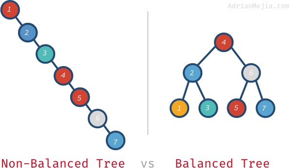

# Binary Search Tree

## Explanation


The image above is a binary search tree.

A **tree** is a data structure where you have **nodes** that are connected together. Each node holds data and pointers to the nodes connected to it.

A **binary tree** is a tree is a tree where each node can only have 2 nodes connected to it, like in the picture. The node above two nodes is called a **parent** node, and the nodes below are called **child** nodes. The node without any parent nodes is called the **root** node. The nodes without any child nodes are called **leaf** nodes.

A **binary search tree** (or **BST** for short) is a binary tree where the data is sorted based on value. A BST sorts the data where the higher value goes on the right and the lower value goes on the left. You can see it in the picture above. 10 is higher than 8, so it is on the right, 3 is lower, so it is on the left. You can see that happening with all the nodes in the picture. This way of sorting makes it easy to find a value quickly. You can just start at the root node and ask if the value you are looking for is higher or lower. The go the appropriate node and ask that question again. You would just repeat that process until you find the value you are looking for, or you reach a leaf node and know that that value is not in the tree.



In the picture above, both diagrams are valid bst's. But the left one is not very helpful, it would take just as long to find a value in it as an array. When a tree is not organized in the most efficient way it is called an **unbalanced tree**. You can convert an unbalanced tree into a balanced one. There are some algorithms that do this. A popular algorithm for balancing a tree is called **AVL** (Adelson-Velskii and Landis).

### Tree Operations In Python

Python doesn't have any trees built-in, but there are third-party libraries you can use. One of those is bintrees.
Bintrees gives every node in the tree a key-value pair.

You can do

```
pip install bintrees
```

to import AVLTree into your project you do

```python
from bintrees import AVLTree
```

These are some operations for a tree using bintrees

| Operation      | Python code             | Performance |
| -------------- | ----------------------- | ----------- |
| add            | tree.insert(key, value) | O(log(n))   |
| remove         | queue.remove(key)       | O(log(n))   |
| find something | queue.get_value(key)    | O(log(n))   |

## Example

Here is an example of a tree being used in a program

```python

```

You can view the python file [here](./python/tree-example.py)

## Problem to solve

Make a function that

You can solve the problem [here](./python/queue-problem.py)

You can view the solution [here](./python/queue-solution.py)
